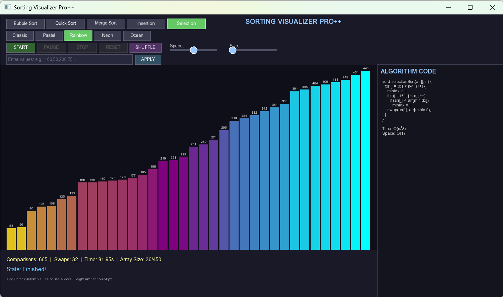

# ⚡ Sorting Visualizer Pro++


---

## 🎯 Overview

**Sorting Visualizer Pro++** is an **interactive educational desktop application** built using **C++** and **SFML (Simple and Fast Multimedia Library)**.  
It visualizes multiple sorting algorithms in real time, helping students and developers understand how data structures and algorithms work internally.

Users can **choose algorithms**, **adjust array size and speed**, **input custom values**, and **watch sorting happen step-by-step** with smooth animations and color-coded feedback.

---

## 🧠 Features

✅ **Five sorting algorithms implemented**
- Bubble Sort  
- Quick Sort  
- Merge Sort  
- Insertion Sort  
- Selection Sort  

✅ **Real-time visualization**
- Animated bar representation of array elements  
- Smooth step-by-step comparisons and swaps  

✅ **Interactive UI**
- Algorithm selection buttons  
- Speed and size sliders  
- Shuffle and reset options  
- Custom input box  
- Dynamic color themes (Classic, Pastel, Rainbow, Neon, Ocean)

✅ **Performance Metrics**
- Comparisons counter  
- Swaps counter  
- Execution time  
- Array size indicator  

✅ **Clean Code Architecture**
- `Button`, `Slider`, and `InputBox` components  
- Separate functions for each sorting algorithm  
- Frame-based animation system  

---


## 🖼️ Screenshots

 
 
 


---

## ⚙️ Technologies Used

- **Language:** C++  
- **Graphics Library:** SFML 2.5+  
- **Compiler:** g++ / Visual Studio  
- **Operating System:** Windows / Linux  

---

## 🚀 How to Run

1. **Install SFML**  
   👉 [Download SFML](https://www.sfml-dev.org/download.php)

2. **Clone this repository**
   ```bash
   git clone https://github.com/YOUR-USERNAME/Sorting-Visualizer-Pro-Plus-Plus.git
   cd Sorting-Visualizer-Pro-Plus-Plus
Compile and run

bash
Copier le code
g++ main.cpp -o SortingVisualizer -lsfml-graphics -lsfml-window -lsfml-system
./SortingVisualizer
Watch the algorithms come to life in real-time 🎬

🧱 System Design
The system is divided into multiple components:

🎨 Visualization Engine
Draws bars and animations dynamically

Color-coded bars for comparison, swapping, and sorted elements

⚙️ Algorithm Engine
Implements all 5 sorting algorithms

Each algorithm runs step-by-step for clear visualization

🧰 UI Layer
Custom-built Button, Slider, and InputBox classes

Dynamic enable/disable logic based on current state

💾 Performance Tracker
Displays comparisons, swaps, execution time, and array size in real time

🌈 Color Themes
🟦 Classic: Default balanced colors

🟩 Pastel: Soft and calm tones

🌈 Rainbow: Vibrant gradient effect

💜 Neon: Bright and futuristic

🌊 Ocean: Blue-turquoise smooth palette

🧠 Educational Value
This project provides a hands-on learning experience for understanding sorting algorithms visually.
It helps users:

Grasp algorithm logic intuitively

Compare performance and complexity

Learn C++ graphics and event-driven programming

🔮 Future Enhancements
Add Heap Sort, Counting Sort, and Radix Sort

Introduce 3D bar animations

Add sound effects for comparisons/swaps

Export sorting visualization as a GIF or video

Web-based version using WebAssembly (C++ to Web)

👨‍💻 Author
Souleymane Doumbia
🎓 Bachelor of Computer Applications (BCA)
🏫 Chandigarh University
📅 November 2025

📝 License
This project is open-source and available for educational and personal use.
Feel free to fork, learn, and improve it!

⭐ If you like this project, don’t forget to give it a star on GitHub!
